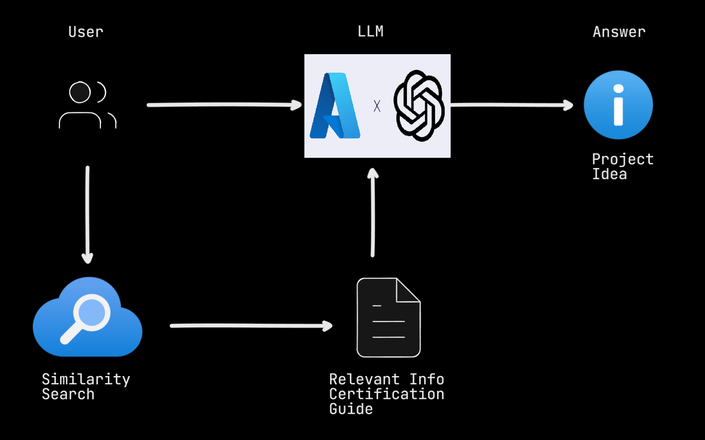

# LangChain RAG with Azure AI Search

This repository contains a Streamlit application that generates project ideas based on Microsoft Azure Certifications and the level of the project (beginner, intermediate, advanced). The application uses the LangChain RAG (Retrieval-Augmented Generation) model with Azure AI Search to generate the project ideas.

## Architecture



## Features

- Use "Create Knowledgebase" button to create the knowledgebase
- Select a Microsoft Azure Certification from a dropdown list (AZ-900, AZ-104, AZ-305, AZ-400).
- Select a project level from a dropdown list (beginner, intermediate, advanced).
- Generate a detailed project idea, including the project name, description, list of services used, and steps to make the project.
- Prompt Template used:

```
template="""
        You are a helpful cloud instructor that provides cloud project ideas about Microsoft Azure Certifications based on the certification guide.
        
        Give me a project idea for certification: {certification} of the level: {level}
        By searching the following certification guide: {docs}
        
        Only use the factual information from the guide to provide the project idea.
        
        If you feel like you don't have enough information to answer the question, say "I don't know".
        
        Your answers should be verbose and detailed. Include a Project Name, Project Description, list of Services Used and Steps to make the project. Make sure your response is in markdown format like:

        ### Project Name:
        Project Description:
        Services Used:
        - Service 1
        - Service 2
        #### Steps:
        - Step 1
        - Step 2
        """
```

## Setup

- Clone this repository.
- Create a [virtual environment.](https://docs.python.org/3/library/venv.html)
- Install the required Python packages:

``` python
pip install -r requirements.txt
```

- Set up your Azure AI Search service and get your endpoint URL and admin key.
- Set up your Azure OpenAI Embedding model service and get your endpoint URL and admin key.
- Set up your Azure OpenAI LLM model service and get your endpoint URL and admin key.
- Create a .env file in the root directory of the project and add your Azure Search endpoint URL, admin key, and Azure OpenAI Endpoint and API key (look at the `.env.example):

``` bash
AZURE_SEARCH_ENDPOINT="<YOUR_AZURE_SEARCH_ENDPOINT_URL>"
AZURE_SEARCH_ADMIN_KEY="<YOUR_AZURE_SEARCH_ADMIN_KEY>"
AZURE_EMBD_ENDPOINT="<YOUR_AZURE_EMBD_ENDPOINT>"
AZURE_EMBD_API_KEY="<YOUR_AZURE_EMBD_API_KEY>"
AZURE_EMBD_API_VERSION="<YOUR_AZURE_EMBD_API_VERSION>"
AZURE_EMBD_MODEL="<YOUR_AZURE_EMBD_MODEL>"
AZURE_OPENAI_API_KEY = "<YOUR_AZURE_OPENAI_API_KEY>"
AZURE_OPENAI_ENDPOINT = "<YOUR_AZURE_OPENAI_ENDPOINT>"
DEPLOYMENT_NAME = "<YOUR_AZURE_DEPLOYMENT_NAME>"
API_VERSION = "<YOUR_AZURE_API_VERSION>"
```

## Usage

1. Run the Streamlit application:
``` python
streamlit run streamlit.py
```
2. Open the application in your web browser.
3. Click on "Create Knowledgebase" to generate and store embeddings to Azure AI Search
4. Select a Microsoft Azure Certification and a project level.
5. It will generate a project idea.